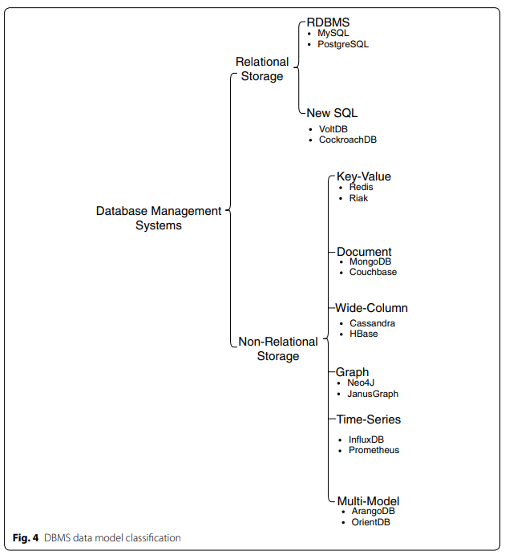

# A survey on data storage and placement methodologies for Cloud‑Big Data ecosystem (2019)

The authors [Mazumdar, S; Seybold, D; Kritikos, K; Verginadis, Y](Article_ASurveyOnDataStorageAndPlacement.pdf) focus is on management aspects which are seen under the prism of non-functional properties [...] the readers can appreciate the deep analysis of respective technologies related to the management of Big Data and be guided towards their selection in the context of satisfying their non-functional application requirements.

Applications have evolved over the years from batch, compute or memory intensive to streaming.  They require significant higher amounts of information that must be consumed from an ever increasing number of heterogeneous sources.  To find the resources for managing these scenarios, many administrators are looking toward _Big Data as a Service_ (BDaaS), which is so far more marketing hype than execution of vision.  Others are evaluting management of multi-cloud strategies.  However, given the size of these data sets a degree of vendor lock-in continues to exist.

## Data lifecycle Management

Specific aspects of this section appear in [Reading: Lifecycles Section](../Lifecycles), and will not be repeated here.

The NIST reference model states that data management phases are: Collection; Preparation; Analysis; and Action (ala create value).

Metadata is a critical system property that needs to be efficiently managed and stored for retrieval.  This allows for appropriate subsets of data to be discovered.

Traditional data lifecycle management focuses on the way data is managed, not how they are processed.  Cloud systems decouple the responsibility of (1) Big Data Processing from (2) resource management.

## What are the key research questions

1. What are the most suitable (big) data storage technologies and how do they compete
with each other according to certain criteria related to non-functional aspects?
2. What are the most suitable and sophisticated (big) data placement methods that can
be followed to (optimally) place and/or migrate Big Data?

## Data Storage Systems

left off on page 21 of 37
