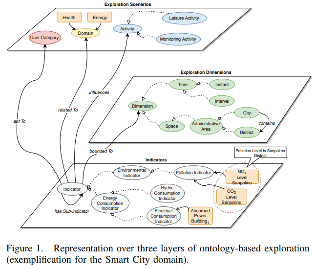

# Data Lake Solutions

## Data Lakes and Data Warehouses, Working Tandom (2019)

According to [McKendrick](Lakes_and_Warehouses_article.pdf) states that Data Lakes are a rapidly growing movement, that 38% of organizations have deployed.  This is up from 20% in 2016 and another 15% are evaluating adoption strategies.  However, this new technology is a complement not a replacement to data warehouses and traditional OLAP experiences, which enjoy a rich ecosystem.  

For startups and enterprises that do do not have DW solutions, many have reported a Data Lake first plan.  The largest driver is cost savings and interoperability.  Challenges can come from this strategy, as organizations are deferring the schematization and data modeling until much later.  This can lead to scenarios of widgets and triagles that don't fit nicely together.  However, the distruption of semi and unstructured data is becoming more the norm in ICBM systems, which forces designs to consider these heterogeneous requirements and how they will fit together.

Though there are many scenarios where unstructured data can be transformed into structured query results.  These results can then be used for reproducable KPIs and timely user sub queries for additional information.  If the lake contains the raw results, there is also a clear seperation of duties between the data scientist and data consumer.  Many business professionals do not have the patience to author big data queries, and instead want simple pre-canned feeds.  When something new is needed they'll kick it over to engineering to _add it to the dashboard_ (likely via a data warehouse).

### Impact of Cloud Systems

The author highlights that most _new_ data lakes are likely to start out in the cloud, as these are the most economical places to gain unlimited storage for pennies per gigabyte.  Though for specific industries there are regulations that prevent them from moving into the public cloud, which is causing solutions such as Azure Stack and AWS Outpost to bring the solution on-premise.  These are stop gap solutions while `Information Goverance` is addressed, and concerns around security and access control addressed.

They also highlight that it is complex to build these systems in the public cloud, because the disjoin tools need to be strung together.  For teams that lack development expertise the barrier can be too high to implement.

### What future compatibility concerns exist

It is challenging to build a future proof enterprise data solution, because the prices of faster systems continue to decrease all of the time.  Not too long ago, in-memory OLAP servers were the hotest thing.  Now GPU-accelerated databases are 10x faster than in-memory and 100x faster than traditional relational stores.

Another revolution is massively parallel processing solutions, such as Spark.  Remember MapReduce, it was huge and now its fallen to niche status.

Governance around data retention and curation need to happen or the lake will become too polluted, and no one will want to swim in it.  Finding gems becomes more an exercise of finding needles in haystacks.

### How does Netflix do data lakes

> "The future of the data warehouse probably looks something like what Netflix has constructed," Brey pointed
out. "Data is housed in a cloud object store; serialized in efficient binary formats like Parquet, ORC, or Avro; and schema and other metadata is stored in a surrogate system like the Hive metastore. This allows the use of
a plurality of data processing and analytics engines."

## Design of Connected Data Lake System based on Micro Cloud Storage (2018)

The authors [Park, S; Cha, B; Cha, Y; Mo, J; Oh, S; Kim, J](Connected_Lakes_based_on_MicroCloud.pdf) propose a solution for dealing with ICBM (IoT, Cloud, Big Data, and Mobile) that ends to accumulate at network edges.  Each of these edge clouds connects to _Message Queue Transport_ designed with Apache Kafka to deliver data into a centralized _Stream Processing Router_.

As the data arrives a job manager acknowledges time windows of data and chunks it into individual tasks.  These tasks are performed and their status persisted into a snapshot store.  Afterwards a centralized management server can query the results.

However, [Harper](../BusinessIntelligence#edge-computing) suggests not doing this and instead leaving the raw results at the end.  This enables local processing of `high volume/low quality` data to become `low volume/high quality` information, and that is centrally propaigated.  A key reason for one-over-other would come down to availability of computation at the edge, if its a bunch of sensors then the results are more limited.  Another challenge is the availability of pools of edge storage as these local items might need a longer retention that finite resources permit.

## A Semantics-enabled approach for Data Lake Exploration Services (2019)

According to [Garda, M](Lake_Exploration.pdf):

> A Data Lake can be conceived as a storage repository that holds a vast amount of data in its native format, until it is needed. Within Data Lakes, heterogeneous data is stored and accessed; however, dealing with this data is cumbersome, time-consuming and inefficient, due to the different data models and file formats.

To address these issues semantic information (aka metadata) needs to be extracted from the lake information and placed into an Exploration process.  This approach enables explorers to query for starting points and then investigate further from there.

Many emerging works are suggesting that the appraoch to dealing with heterogeneous data.  Others are focusing on probabilistic solutions such as labelling data through fuzzy variables.  More advanced actors create ontologies and knowledge graphs to show the relationship between these different artifacts.

### Limitations of Data Exploration

The states that most data exploration systems focus on the visualisation and analytical aspects, instead of proposing techniques to accomplish user exploration demands.  They mean that it is difficult to gain a personalised approach to exploration.  Perhaps, the user is a teacher and they want to see their student's artifacts.  In this scenario, they care more about _the items themselves_ not their statistical relevance to particular aspects.  The goal is to understand their student, and only that aspect.

### Personalised Exploration

The primary pillars of lake exploration are:

- Data Lake Representation
- Ontology apt to provide knowledge required to model exploration scenarios, dimensions and indicators
- Services interacting with the ontology and responsible for providing exploration support

These exploration aspects need to be associated with one another to allow a natural chain of discoveries.  Perhaps the user wants to know when to plant their crops, and that leads to suggestions around spring.  This idea leads to historical weather data as a mechanism to pick more specific periods, etc.  As they look at those related historical weather reports, specific subsets will not be relevant and the personalization system can hide them.  This focuses the exploration on higher probability items and leads to better results in less time.

