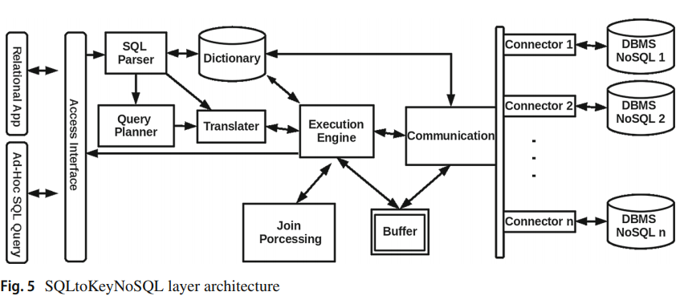

# Migration to NoSQL Systems

## Document-Oriented Data Schema for Relational Database Migration to NoSQL (2017)

The authors [Hamouda, S; Zainol, Z](DocumentedOriented_DataSchema_for_Relational_to_NoSQL.pdf) state that Big Data is becoming a common component in enterprise systems.  This explosion of data is exposing the cracks in relational database management systems, and causing workloads to transition towards Not Only SQL solutions.  The transition comes with a steep learning curve and high cost as applications have been designed to support relational models.

### Noramilzation rule model

An automated solution to magically transform SQL -> NoSQL schema does not exist, however there are _rules of thumb_ that improve the manual experience.

- The multi-valued attributes are converted into array data.
- Both data items are converted into a single-data item if any full functional dependency exists.
- The same relational database rules are applied for the partial and transitive dependency.

Additional rules are needed for important features, such as weak entities, composite attributes, M:M relationships, primary keys, and foreign keys.  The remainder of the article continues exploring these ideas through a combination of UML and Entity Relationship diagraming for an example application.

## Bringing SQL databases to key-based NoSQL databases: a canonical approach (2019)

The authors [Schreiner, G; Duarte, D; Santos Mello, R](Schreiner2019_Article_BringingSQLDatabasesToKey-base.pdf) continue where Hamouda & Zainol left off, with a translation layer called _SQLToKeyNoSQL_.  This framework is capable of automatically translating specific queries at runtime, so that source code does not modification.

The mapping relies on a canonical model that binds a hierarchial structure to a relational schema.  This allows them to handle scenarios, such as joins that do not need a second lookup or projections.

The article concludes with some experimentation data that shows the system has the potential to be faster.  They attribute this to:

- Mongo Backing Store is Using Bulk GetItems
- Second System Does Not cache the Schema, doubling network transactions

However, it is still an impressive transcription of the SQL query into NoSQL primative operations.

