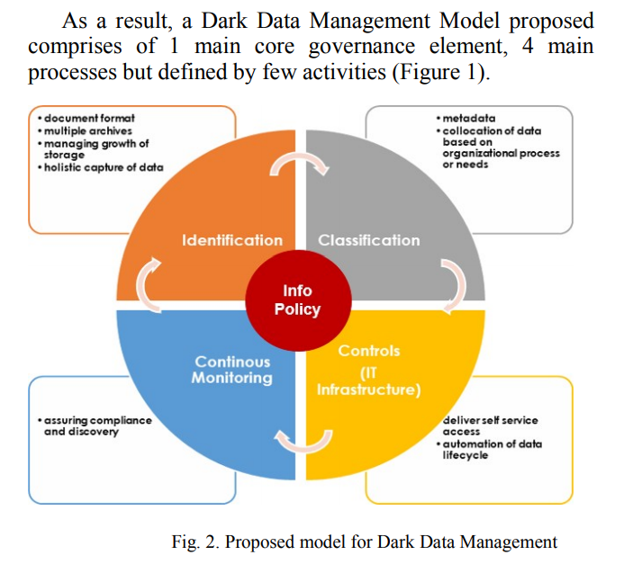
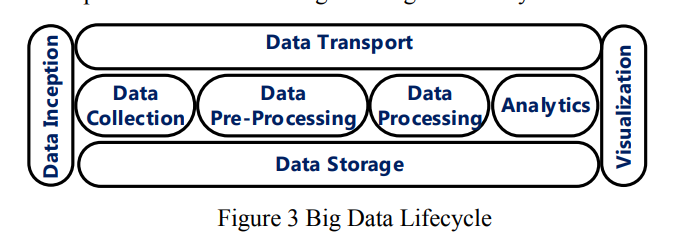
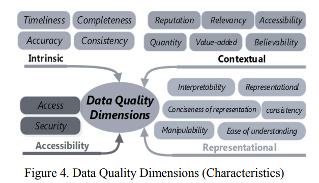
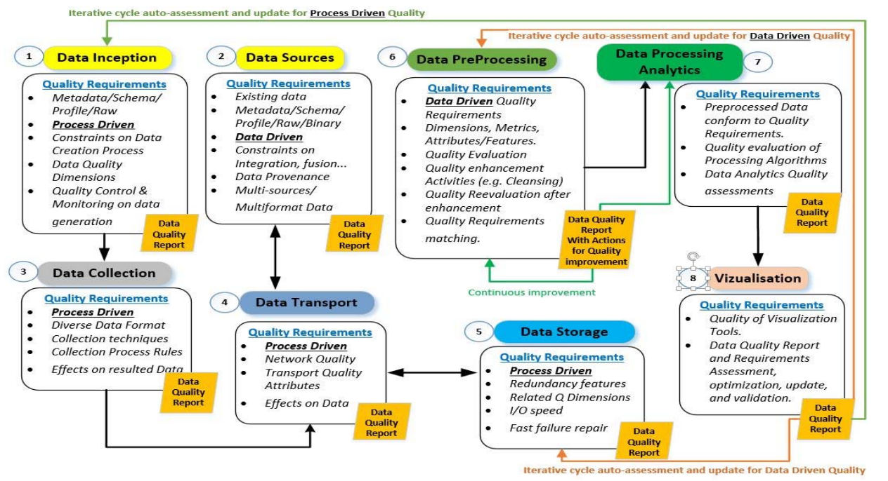

# Big Data Readings

## Dark Data Management as frontier of Information Governance (2019)

The authors, [Ajis, A; Baharin, S](Dark_DataMgmt_frontier_of_Information_Governance.pdf) discuss the importance of `Information Governance` (IG) as a means of managing the accumulation of dark data.  Dark Data is defined as any information which has been collected but not yet minded for intelligence.  These pools are becoming common place as the cost of storage has decreased to the point that `write-once x read-maybe` systems are the norm.

Another challenge with these pools is that classical approaches to data analysis are no longer sufficent.

1. large percentages of the data is unstructured or semi-structured
2. the volume exceeds typical scalability of relational stores (e.g. ACID versus BASE)
3. the speed that information needs to be unlocked exceeds legacy "one big iron server mentality" (e.g., horizontal vs verticle scaling)

They argue that through proper `IG` these issues are partially contained, and data experts are able to focus on subsets of facts that can address their business questions.  These information policies enable dark pools to be _tagged_, such that their operational onboarding occurs in a prioritized fashion.

## Big Data Quality: A Survey (2018)

The authors [Taleb, I; Serhani, M; Dssouli, R](BigDataQuality_Survey.pdf) state that communication technologies are generating and collection vast quantities of data.  While the process of storing these pools of data is mature the notion of `Big Data Quality` is still in early stages.  This raises the questions:

Past the original three characteristics, [Firican, G(2017)](https://tdwi.org/articles/2017/02/08/10-vs-of-big-data.aspx) [Cached](The_10Vs_of_BigData.pdf): Volume, Velocity, Variety, Variability, Veracity, Validity, Vulnerability, Volatility, Visualization, and Value. -- Shawn proposes adding Vermont as the 11th state.

### What is big data

> Definition: there is no clear and final definition of Big Data according to many references such as: [8], [9], [11], [12]. It is _high-volume, high-velocity and high-variety information assets_ that demand cost-effective, innovative forms of information processing for enhanced insight and decisionmaking. “Big Data” is used to describe a massive volume of both structured and unstructured data; therefore, it's difficult to process it using traditional database and software techniques. It refers also to the technologies and storage facilities that an organization requires to handle and manage the large amounts of data that derives from multiples sources.

### What are the key challenges

1. if the data is low quality, does it have value?
2. what processes should exist to `pre-process and clean` data.  

They state that _Data Quality Management_ is well understood in the traditional database community, however the notions of foreign constraints and ACID consistency are difficult to directly apply to _unstructured data_; as is commonplace for social and machine/service logging.  How are we supposed to ensure that a tweat only exists in the dataset *after* the users are known?

> In Big Data, data originally comes in different aspects, from multiples sources that must be cleaned, filtered, processed, integrated, merged, partitioned, transported, sketched, and stored. All these steps are executed in real-time, in batch or in parallel and preferably on the cloud. While it is well-known that, in theory, more high quality data leads to better predictive power and overall insight, this raw data must be channeled through a quality assessment in the pre-processing phase in which activities such as data cleansing, de-duplication, compression,
filtering, and format conversion take place. This mandatory step is essential to refine, valuate the data and ensure its quality.

### What is Big Data Lifecycle

This diagram shows the phases of data pipelining for operationalizing data sources.

### What aspects drive data quality

High quality data should be measured against its "fitness for use" (ISO 25012 Standard), based on aspects:

1. Intrinsic
2. Contextual
3. Accessibility
4. Represenational

### How can data and process driven designs improve data quality

> Based on the above, future research directions in Big Data quality should be geared towards the development of solutions that consider the following:
a) Assessment of quality as earlier as possible and it end-to-end integration across its.
b) Implementation of continuous quality improvement and enforcement mechanisms in Big Data quality management.
c) Specification of Big Data Quality metrics that should cope with the data dynamic nature and its unconventional characteristics.
d) Development of new quality dimensions with specific measurement attributes for unstructured, and schema less
data.
e) Enforcement of quality requirements, generation of quality reports and feedbacks to support assessment activities.
f) Development of more Online automated real-time dashboards for Big data quality monitoring.
g) Application of higher degree of statistical proof in different Big data quality evaluation processes including sampling, regression, correlation, and matching.
h) Development of effective quality outcomes prediction.
i) Evaluation of quality of a representative set of data samples then generate a quality model to apply on the whole Data. This will get a glimpse of the data quality and proceed with the equality results applied on all the data [45]– [47].

