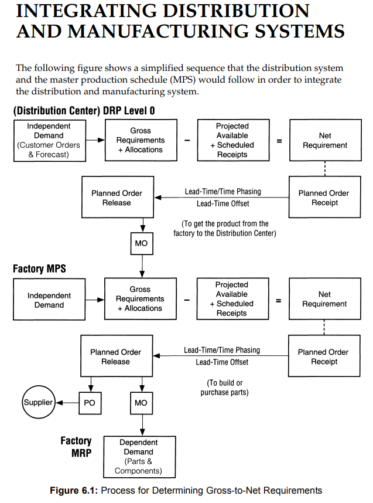

# Inventory Management Overview

```text/citation
Viale, J. David. Basics of Inventory Management : From Warehouse to Distribution Center, edited by Christopher Carrigan, Course Technology Crisp, 1996. ProQuest Ebook
 Central, http://ebookcentral.proquest.com/lib/ncent-ebooks/detail.action?docID=3116996.
```

## Module I: Inventory Objectives and Policies

> The objective of inventory management is to replace a very expensive asset
called “inventory” with a less-expensive asset called “information.” In order to
accomplish this objective, the information must be timely, accurate, reliable and
consistent.

1. Maximizing Customer Service
2. Maximizing Efficiency of Purchasing and Production
3. Minimizing Inventory Investment
4. Maximizing Profit

### What is the cost function for carrying inventory

> There is a basic premise (principle) of this book that states, “the larger the
forecast error, the higher the desired customer service level, the more inventory
that must be carried.”

### What are the types of inventory

> There are five basic types of inventory: raw material, work-in-process, finished
goods, distribution inventory and maintenance, repair, and operating (MRO) supplies

1. Cycle stock is the most active parts of inventory
2. Safety stock is the buffer to protect against fluctuations/forecasting error
3. Transportation inventory - Inventory in a different location (e.g. distribution center)
4. Anticiption stock - Inventory build of for a seasonal demand
5. Hedging Stock - Inventory for an event that might go unused

## Module II: Independent Demand Inventory Systems

> Independent demand models are methods to manage items whose demand is
influenced by customer demand or demand from outside of the company
control.

1. Fixed Reorder CYCLE Inventory Model
2. Fixed Reorder QUANTITY Inventory Model
3. Optional Replenishment System
4. Joint Replenishment System
5. Forecasting (discussed in Module III)

Ordering systems needs to have sufficient lead time to consider manufacturing and transportation delays. There also needs to be consideration for the optimizing for volume purchases that minimize spoilage.  One approach is to use joint-replenishment which _combines_ several small items into one larger purchase.

### VI: Distribution Inventory Planning and Control

> The physical distribution of products flows through a variety of geographically
placed distribution points. The distribution points could include the
manufacturing facilities, distribution centers, wholesalers and retailers, or the
distribution of goods may flow directly to the customer or through various
levels as shown below. Inventory is carried at each location based on criteria
such as cost, desired customer-satisfaction level, and efficiency of the
distribution operation.

### What are the types of distribution systems

- *Pull Systems*: Field management teams request items for their local location.
- *Push Systems*: Centralized management provides items based on specific metrics.

Pull comes at a risk of wasting inventory between distribution centers (e.g., inefficient routing) and push is unable to response to local customer requirements.

### What are the strategies for forecasting

- Aggregate forecasting is done at the distribution, then summed up
- Aggregate forecasting is done on a whole, then split accordingly

### What is the workflow for integrating distribution and manufacturing systems


