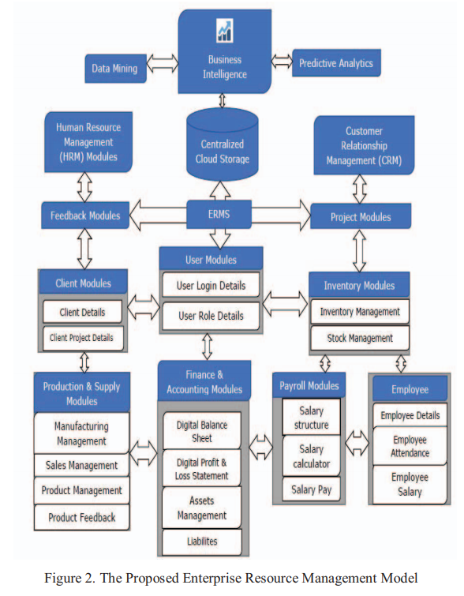

# An Enterprise Resource Management Model for Business Intelligence, Data Mining and Predictive (2017)

In _2017 7th International Conference on Cloud Computing, Data Science & Engineering - Confluence_; [Jayaram, A; Singal, S](Enterprise_Resource_Management_for_BI.pdf) describe the aspects and need for an ERMS solution.  An ERMS system tracks all business artifacts, such as inventory, payroll, and accounting details for an organization.  They argue that every successful organization has one, with the better implementations connecting all divisions of the enterprise.

