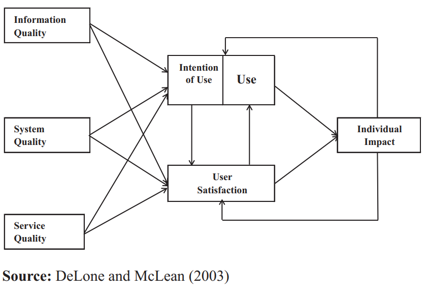
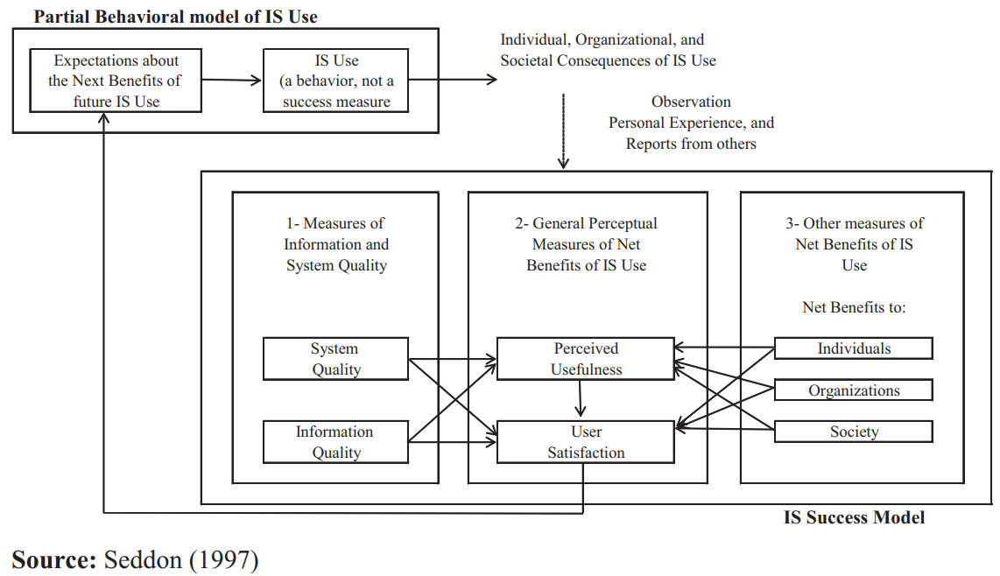
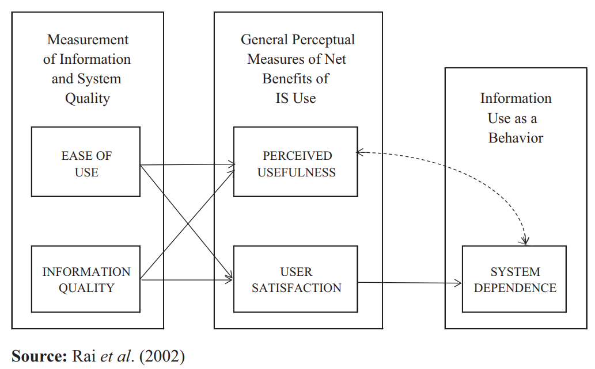

# Analysing the impact of a BI system and new conceptualizations of system use (2019)

In _Journal of Economics, Finance & Administrative Science. Nov2019, Vol. 24 Issue 48, p345-360._; [Goznales, R; Wareham, J](Analyzing_Impact_of_BI_new_conceptualizations_of_system_use.pdf) use empirical models to measure the impact of adding business intelligence systems to Peruvian organizations.  Their study includes 15% of Peru enterprises that use BI and represents a _macro but not generalizable_ view.

## What are companies investing in BI technologies

> Business intelligence (BI), one of the most important components of information systems (IS), is playing a very relevant role in business in this time of high competition, high amounts of data and new technology. Currently, companies feel pressured to respond quickly to change and complicated conditions in the market, needing to make the correct tactical, operational and strategic decisions (Chugh and Grandhi, 2013). BI is one of the most important drivers of the decade (Gartner, 2013). Big companies of IS are creating special units specialised in BI, helping companies become more efficient and effective in daily operations.

## How do you measure impact

The authors propose three models to measure impact, that are essentially build on the previous iteration.  These models are centered around:

- Quality of aspect (e.g., information, system, service, ...)
- Usability and user satisfaction
- Usage that leads to results

### Influence of mandatory versus voluntary usage

A literature review discussed how the highest usage occur when middle management has no choice but to use the system.  As the ecosystem moves towards a voluntary context users still have power over
the level of use, grounded on their personal ability (attitude and intention), and after that the
variability of their usage qualifies the system use construct as a relevant one (Hartwick and
Barki, 1994).

Essentially, users will use the minimum required by the organization plus the argmin that personally benefits them porportial to the ease of use.

## What are the diagrams for the compared studies

