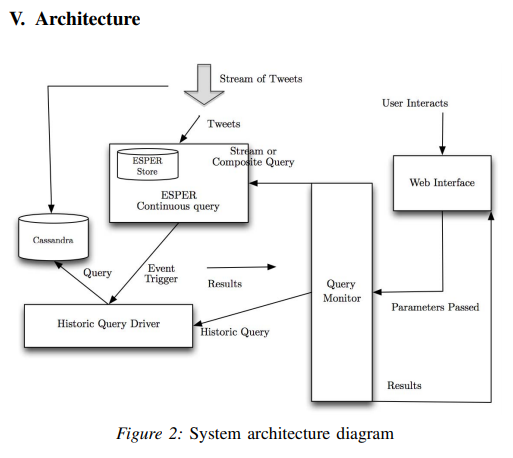

# Event Stores

## A Platform for Analysing Stream and Historic Data with Efficient and Scalable Design Patterns (2014)

For _2014 IEEE 10th World Congress on Services_; [Simmonds et al.](Platform_StreamData_DesignPatterns.pdf) propose a system for consuming Twitter firehose into Casandra for near realtime analytics of 5-100k tweets per second.  They defined a query language called `Continuous Query Language (CQL)` to parse and aggregate metadata as it became indexed into the big data cluster.

*Note*: It appears that Twitter firehose has been replaced with [Decahose streams](https://developer.twitter.com/en/docs/tweets/sample-realtime/overview/decahose) and now requires an enterprise license.

## ChronicleDB: A High-Performance Event Store (2019)

In _ACM Transactions on Database Systems, Vol. 44, No. 4, Article 13. Publication date: October 2019._; [Seideman et al.](ChronicalDb_EventStore.pdf) present ChronicleDB, a novel database system with a storage layout tailored for high write performance under fluctuating data rates and powerful indexing capabilities to support a variety of queries. In addition, ChronicleDB offers low-cost fault tolerance and instant recovery within milliseconds.

Event stores, sometimes called time series databases, are responsible for ingestions and querying across billions of data objects.  These objects are sequential instances within a series and require specialized technologies, instead of relying on generic relational stores, such as Postgres.  The scalability of these systems is critical, as the number of sensors added to e.g., industrial IoT systems continues to grow exponentially.  To meet these needs, companies are looking toward Casandra and HBase, though these systems come with additional complexity that can introduce significant OPX/CAPX.  Alternative append-only technologies have emerged to address these aspects in part, though many different products offer limited support for common exceptions like out of order events.

### How did they build a better solution

The major design principal is _the log is the database_, they avoid additional operations as it only introduces more I/O.  This approach removes buffering strategies and only for out-of-order do they need special behaviors.  As the data ingests into the log it traverses through a collection of event queues, workers, and disks -- to provide memory based FIFO queues and decouple producers.  There's one queue per `event stream`, where an event stream represents a sequential feed of data objects.

### How is the storage layed out

By default, the log is written and read in a sequential manner.  This requirement constrains the layout of log files to be relatively simple, and avoid random access as is common in generic relational stores.  Within the log is a sequence of blocks, with each block a fixed size and populated with pointer offsets to the individual records.  These pointers use a virtual address strategy that uses relative jump lengths to interview user data -- for performance purposes.  Some of these blocks will be variable sized on disk due to the LZ4 compression algorithm that causes a distorion between logical and physical sizes.

An address translation tree allows for the physical addresses of records within a block to be relative within a hierarchical structure, to support fast recovery of a node failure.  These ATT-blocks are interweived within the macro blocks that also contain compressed user data blocks.  Another advantage of this model is that sliding windows are extremely efficient as the operations requires moving the read head 8MiB to reach exactly the next block.

There is also an index on write schemantic as the ATT and user data can be committed at the same time, versus other systems that rely on distinct files and could not make the same optimization.  Another strength comes from the `TAB+-tree` (Temporal Aggregated B+-tree), which is a B+-tree that is indexed on timestamps instead of object primary key values.  As values are appended to the tree, aggregations statistics (e.g. sum,min,max) are updated in real-time to avoid performance penalties if they are ever needed.

### How are out of order events handled

A series of active blocks are held in memory and flushed to disk as a duration theshold is exceeded.  This allows for out of order events to be handled within a reasonable delay.  If the delay is longer, then a new block will be created and indexed into the TAB+-tree at the appropriate point.

### What else did they say

Left off around page 25, gotta wash the kid.
