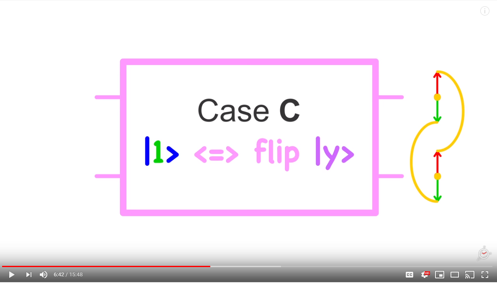
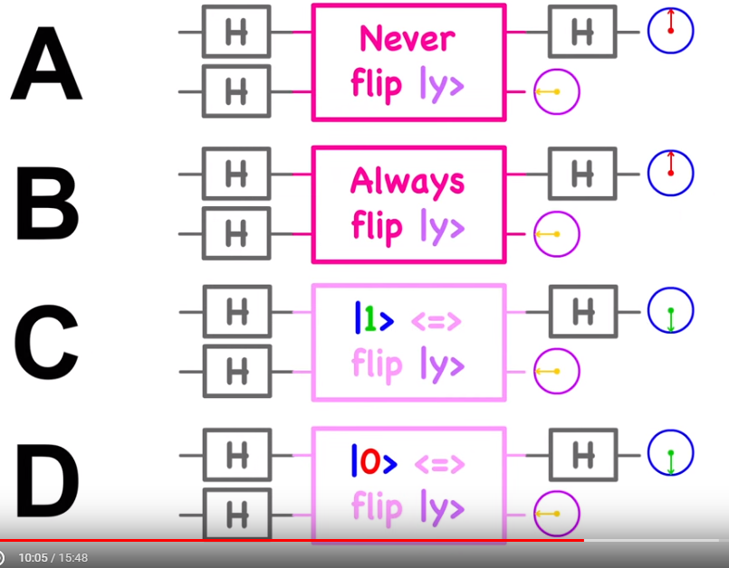
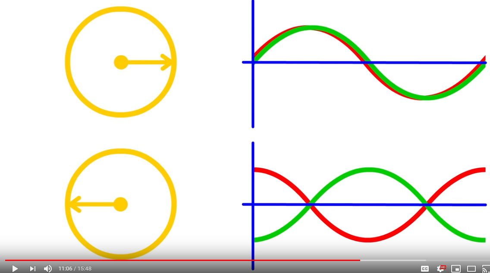
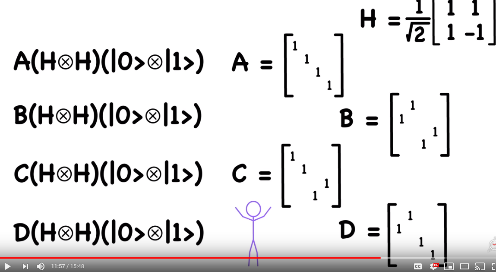
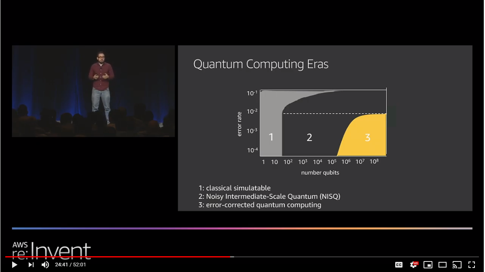

# Quantum Databases

## Grover's Algorithm Explained (2019)

In [Grover's Algorithm Explained](https://www.youtube.com/watch?v=3WWrQXcktqc), Naihin explains that Grover's algorithm is a quantum based transform that _iteratively boosts the probability of finding a value that's within a series of buckets_.  The algorithm constructs a loop through a number of `hadamard gates` at the end of each cycle, the amplitude (probability) is increased across the buckets leading to a shift in the likelihood of being correct choice. This can be applied to various scenarios, such as NoSQL databases where a non-indexed value resides in an arbitrary node.

An analogy would be a ball exists in 1 of 10 equal boxes.  To determine which one has the ball, first they are shaken up and down and that causes some noise from boxes (1, 3, 6); so the probabiliy curve adjusts to account for this.  Next the boxes as shaken left to right, this causes noise from (3, 6, 7, 8); and the probabiliy curve adjusts to convey there's more evidence its in 3 or 6.  The boxes are continually shaken from different direction, resulting in high confidence that the correct choice is box 3.  That box is opened and found the ball (...or a dead cat).

## You don't know how Quantum Computers work (2015)

In [this video](https://www.youtube.com/watch?v=ZoT82NDpcvQ), Frane if Essence explains that `Qubits` are in a spherical _super position_ that contains an `Alpha and Beta` component that represent the probabilities of being `1 or 0`.  For illustrative purposes these can be sliced into a layer to become a circular super position and the `complex number` can be treated as a `bit`.  When two of these "simplified qubits" cross through a `blackbox transformer` they exit in one of four positions.

| Case Name | Association | Description |
|----------|--------|-------|
| A    | Laid-back |Does nothing |
| B    | Laid-back |Always Flips |
| C    | Needy |if `|x1>` positive then `|y>` equals `flip( |x2> )` |
| D    | Needy |if `|x1>` negative then `|y>` equals `flip( |x2> )` |

### How does Hadamard Gates help

The qubits can only be run through the `black box transformer` once, so it becomes impossible to know if the result of (x1, x2) is because of case (A,C) or (B,D).  To work around this limitation, x1 can be put into a super position of both (0 and 1).  A `hadamard gate` specifically allows these multiple positions to be expressed in a computation.

Assume that `|x1>=(1 and 0)` and `|x2> =1` when the `tranformer=case c`; then the hamard gate would result in an `entanglement`, so the value `|y> = |x1> equals |x2>`.  When either is measured it collapses them finite value so `|x1>` is only `1 or 0`... but wait we still dont know for certain its _actually case c_

### Applying Deutsch's Algorithm

Using Deutsch's Algorithm, we can set `|x1>=(1 or 0)` in position right, then update `|x2>=(1 or 0)` in position left; and run the result through two hamamard gates.  The entanglement of the entanglement has now encoded the two stages of reduction (e.g., (A,C) vs (B,D) then choose between (A or C) `or` (B or D)).

### What does phase left/right mean

The different horizontal positions represent if the values `0 or 1` are insync or out of sync.  Similar to how traditional math allows multiplying by `1 and -1` maintains the value, these phase shifts can also be applied.

### Why is this difficult to understand

The core problem with following along is that these transforms are happening in 4-dimensional space, and this is not a natural way for most people to think.

## Introducing Quantum Computing with AWS (2019)

In [this reInvent session](https://www.youtube.com/watch?v=BV9TZWuAwyk), Brandao, F and Kessler, E review the challenges with operationalizing quantum computing and the direction of the industry.  The primary driver of quantum comes from the fundamental acceleration to matrix operations which needle by `10^x not 10*x`.  While the defacto example is breaking cryptography (6000 qubits) more meaningful and obtainable solutions exist in optimization (100qubit) and protein folding (200qubits).  Google's `Sycamore` is the state-of-the-art chip with 53qb, though several others are also working on solutions.

Note: The size estimates assume noise-less qubits, in reality its exponentially larger (e.g. optimizations need >=500k qubits).

### How big is a qubit

The cost to simulate qubits grows at an exponential rate, with the influence of entanglement causes the need for long qubit strings.

| Qubits | Data Size |
|----|----|
| 30 | 16Gb|
| 40 | 16Tb|
| 50 | 16Pb |
|333| 10^100 (= count(particals in known universe))|

### What are the eras of quantum

Brandao outlines three eras of quantum computing, that are largely driven by our ability to (1) Handle noise within the qubits strings and (2) limitations in simulations.  In a quantum computer a qubit is represented by e.g. an the rotational direction of an atom that is transitioned with a laser.  Orienting these microscopic units is complex and does not always happen correctly.  A similar problem exists in traditional computer RAM, where individual bits periodically flip.  These scenarios are handled by redundant encoding (e.g. use 3 bits and a voting protocol), though a similar solution becomes exponential on Qubits.

We are presently entering the second era, which causes aspects of the system to run in compute processing units (CPU) simulation and others to reside on small quantum processing units (QPU).  Amazon recently released `Amazon Bracket` as a fully managed `Quantum as a Service`, so that users can start to experiment with programs that run in these hybrid models.  As the technologies evolve algorithms that target the platform can be transitioned to proprietary hardware with minimal changes required.

.

### How does a hybrid CPU/QPU strategy improve matters

Consider a scenario like machine learning, where the CPU attempts to measure an inferance based on some cost (aka objective) function.  That cost function is approximated by sending thousands of examples through a neural network to train the model weights.  Today that training uses GPU cards because of their specialization in matrix multiplication (called tensors).  However, in the future QPU could accelerate tensor flows (get the name?) to tune the model more accurately in less time.
