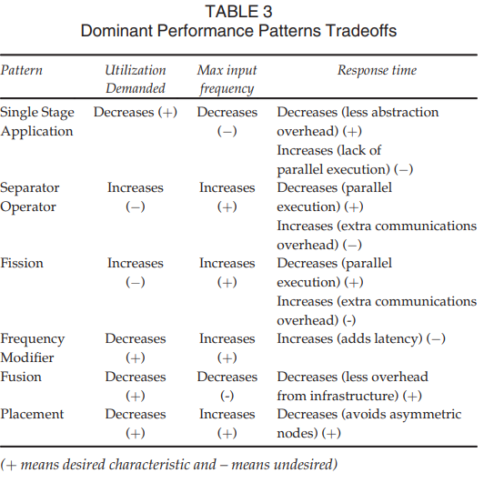
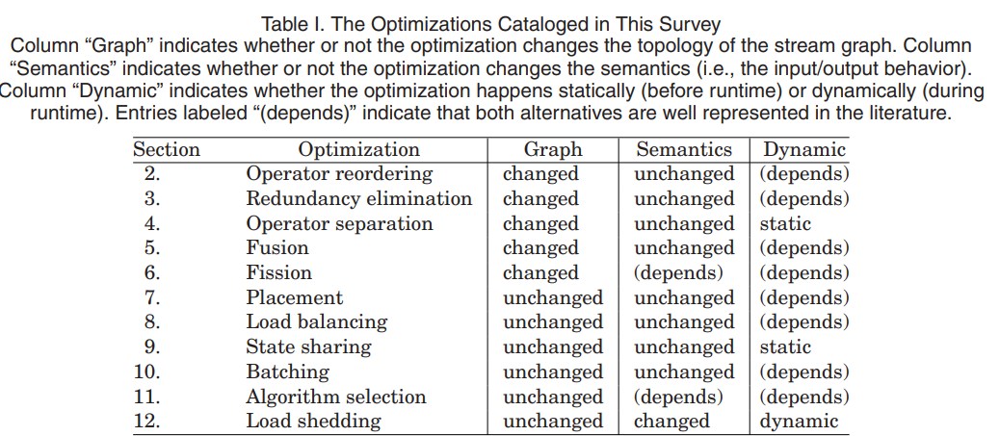

# Stream Processing

## Patterns for Distributed Real-Time Stream Processing (2017)

In _IEEE TRANSACTIONS ON PARALLEL AND DISTRIBUTED SYSTEMS, VOL. 28, NO. 11, NOVEMBER 2017_; [Basanta-Val et al.](Distributed_StreamProcessing.pdf) describe commonalities of continuous processing of big data information as it enters the system.

> In the real-time context, a real-time stream is defined as a continuous sequence of data or items whose processing has some real-time requirements like a deadline from the input
to the output.

### Why do we need realtime streaming

There are many systems that require real-time processing as the volume of data is too large to even store.  Consider the Hadron collider, that generates 300Gb/s and needs to be aggregated down to 300Mb/s for offline processing.  Other scenarios, such as HFT need to make decisions within sub-second deadlines.

### Why is this a hard problem

Two of the most common technologies include Hadoop and Storm, though only Storm can address real-time stream processing and that occurs at great inefficiency to the infrastructre.  There has been significant work to create patterns like `realtime map/reduce` though these technologies are not very mature nor widely adopted.  Solutions like Apache Spark focus on high-frequency response time and do not address application deadlines.

### What are state-of-the-art solutions

There are three distinct categories that tend to be used:

- Map-reduce based solutions (e.g., micro batch or other incremental policy improvements)
- Distributed stream processing (e.g. storm) attempt to abstract the processing network into multiple components (e.g. operator seperation)
- Realtime parallel computing (e.g. OpenMPI, fork/join) uses a message queuing strategy to keep some large body of CPU cores busy

In each of these systems a `cluster` has some number of `CPU` workers that are associated with a specialized task.  Paths between these tasks are loosely static and they essentially become an abstract circuit.  Some scheduling algorithm is required to ensure fair utilization and load distribution.

### What patterns are applied across these solutions

*Single Stage Application Pattern*.  All operations are performed on a single worker, reducing communication overhead at the expense of additional computation overhead.  Consider the wasted resources that could take place by interweaving more operations or fanning-out parallel sub tasks.

*Operator Seperation*. Operations are split into two stages, so that the action can be left and right side are reduced (or similar communative action) in parallel.

*Fission Pattern*.  Divides the branches across multiple tasks and then merges the results in a later stage.

*Frequency Modification Pattern*. Application applies a filter (e.g., sampling strategy), so that the next stage acts across less data.

*Fusion Pattern*. A stage that combines two existing stages into one logical unit (e.g. join operation).

*Placement Pattern*.  The use of metadata to fan-out tasks to specific workers (e.g. send all `foo` traffic to node `bar` and `cheese` traffic to `zed`).

## A Catalog of Stream Processing Optimizations (2014)

In _ACM Computing Surveys, Vol. 46, No. 4, Article 46, Publication date: March 2014._; [Hirzel et al.](StreamProcessingOptimizations.pdf) expand on these patterns with a collection of strategies to improve processing rates.  For instance, the operator reordering states that more selective filters should run before relaxed instances.  Another proposal is to apply dedup steps early on so that the net volume through the processing network decreases.

These volume reduction methods also apply to state that can often be placed in shared memory and a pointer passed between the systems.  Many of the ideas of this paper overlap with Basanta-Val et al.

## Reliable Speculative Processing of Out-of-Order Event Streams in Generic Publish/Subscribe Middlewares (2013)

In _DEBS’13, June 29–July 3, 2013, Arlington, Texas, USA._; [Mutschler, C; Philippsen, M](ReliableSpeculativeProcessing.pdf) focus on the stream processing patterns for out-of-order eventing (OOO).  They state that OOO is naturally occurring due to the events routing across multiple worker nodes.

### What strategies are typically used

- Buffering middleware.  This is difficult to correctly configure as too short negates the value, and too long introduces delays.  Many systems are also capable of generating the correct answer (e.g., communative operations).
- Speculative middleware.  The system keeps track of a buffer of events, and replays sequences only-if an OOO event is detected.  This is analogous to CPU pipeline design.

The authors propose a solution that uses a hybrid solution to offload the buffer from the critical path, and external monitor for application specific rules.  When a rule is broken, then they apply a remediation policy to replay the new choices.  How this works, is sequences of related events are ordered in processing queues and if an OOO arrives it is placed into the correct place in line when possible.  Since processors are pulling from the buffer there's a more likely chance that no remediation is needed since the processing queue is still draining.

## An Efficient Framework for String Similarity Continuous Query on Data Stream (2018)

In _The 2018 5th International Conference on Systems and Informatics (ICSAI 2018)_; [Cui, J; Shi, L; Li, J; Liu, Z](StringSimularity_ContinuousQuery_on_DataStream.pdf) provide an strategy for evaluating string similarity in streaming data.  The solution can work on any `set` of symbols and relies on a _preprocessing stage_ plus _candidate inspection stage_ to find reduce the number of index entries that are compared using an `edit distance function`. They rely on a sliding window and a `last_seen` timestamp to manage index eviction policies.
