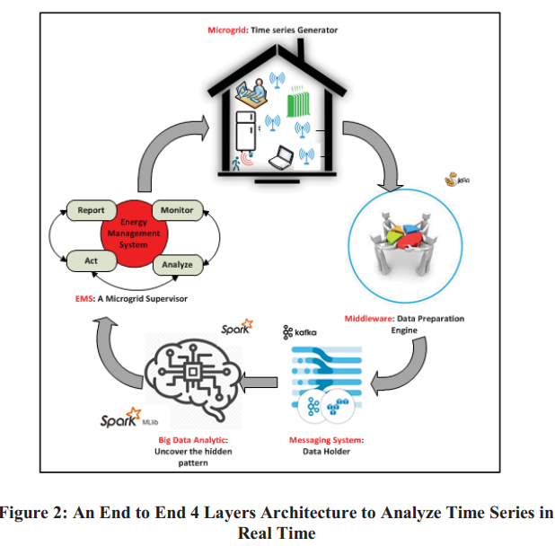

# Timeseries Analysis

## An E2E Time Architecture for Analyzing and Clustering Timeseries Data (2018)

The authors [Talei, H; Benhaddou, D; Essaaidi, M](E2E_Realtime_Analyzing_Timeseries_Data.pdf) discuss the systems architecture used by _Al Akhawayn University smart grid project_ to cluster sensors data as a way to unveil some patterns that can be used by an energy management system to control the energy consumption within the university campus.

Their solution uses a `semantic model` of electric microgrids that build a network of smartgrids.  Each node in the network consumes power and publishes statistics about current usages.  The usage time series information flows into the data preparation engine based on [Kaa IoT Project](https://www.kaaproject.org/).  Rules determine which events or aggregation results are interesting and forward into Apache Kafka.  These are consumed into Apache Spark to perform machine learning and custom business logic.  Finally the messages flow into the microgrid supervisor for reporting and control over the microgrid.

### How was the Kaa storage configured

The Kaa service was setup as three-node cluster with Apache Zookeeper to control uptime.  The data is split between Mongo, Cassandra, and Microsoft SQL.  Multiple Kafka topics were provisioned to route messages to propriatry consumer groups, such as student research projects and private web services.

### How was Spark used

Apache Spark ran multiple machine learning models, specifically looking for

- classification of behavioral states
- regression of numeric sensor values
- clustering of similar sensors
- graph analysis of relationships between different sensors
- association analysis of event A followed by event B+C

## Toeplitz Inverse Covariance-Based Clustering of Multivariate Time Series Data (2017)

In _KDD’17, August 13–17, 2017, Halifax, NS, Canada_; [Hallac, D; Vare, S; Boyd, S; Leskovec, J](Covariance_Clustering_multivariate_timeseries.pdf) propose a strategy for examining the structure of multiple time series to determine the different states of the underlying agent.  After classifying which state an agent is currently in, more specialized contextually sensitive analytics can be performed.  The authors offers a video explaination that is both [2 minutes](https://youtu.be/Fh5fRiRd3Q4) and [21 minutes](https://youtu.be/QYUyAbuHrSs) long.

For example, a FitBit will report different heart rythms when the user is sitting versus running.  Based on these distinct patterns in the structure (not the wave distance), the system can learn which one is presently occurring.  Then related sensors can associate that e.g., the rapid heartbeat is from the exersice not a heart attack.  These states are undefined though after discovering them, state machines can also model them further.
